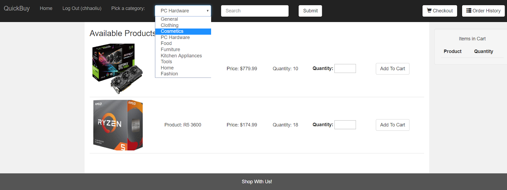

# PHP Shopping Cart

## Description
This is an online webstore implementation made using PHP, HTML, Bootstrap styling, and mySQL. This was done as a basic exercise in front-end and back-end development. The webstore includes images, items organized by category, add to cart, checkout, check order history, and search functionality. Users can choose to log in after creating an account or to browse the webstore without an account. 

## Logged-In Users

* Can search by category via dropdown menu
* Can search by item name via search bar
* Can add/delete items from cart
* Can checkout their cart
* Can check their order history, which is ordered by datetime

## Logged-Out Users

* Can search by category via dropdown menu
* Can search by item name via search bar
* Can create an account

